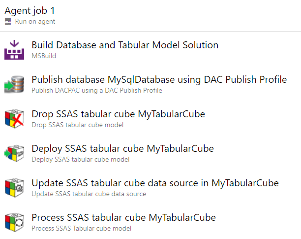
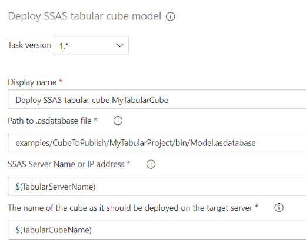
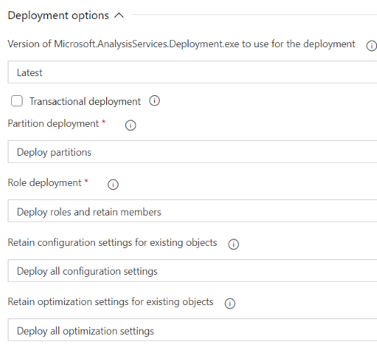
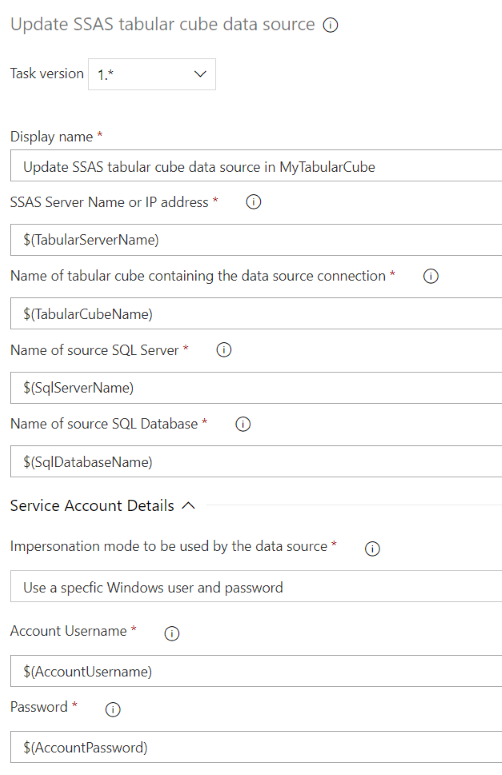
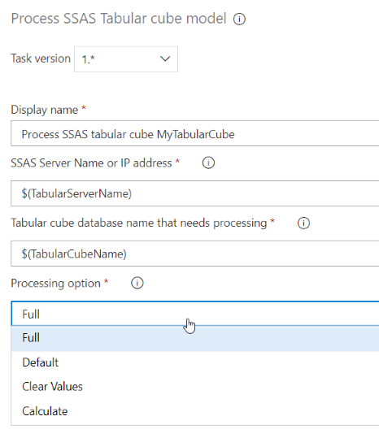
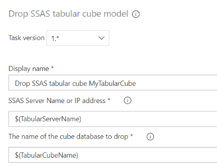
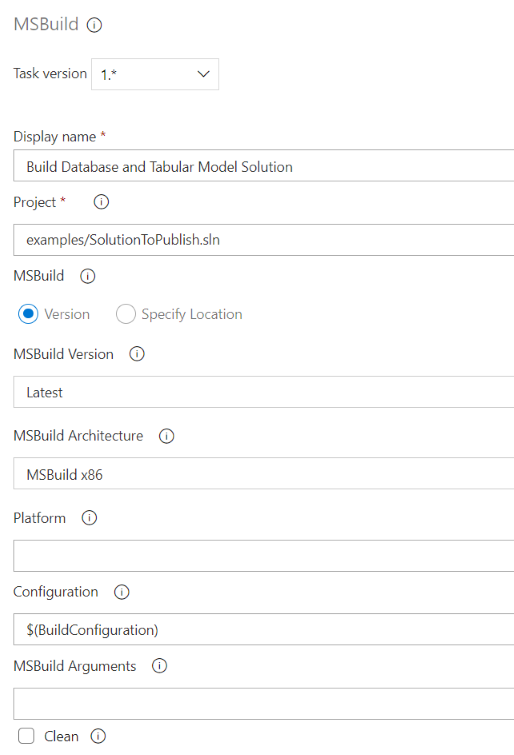
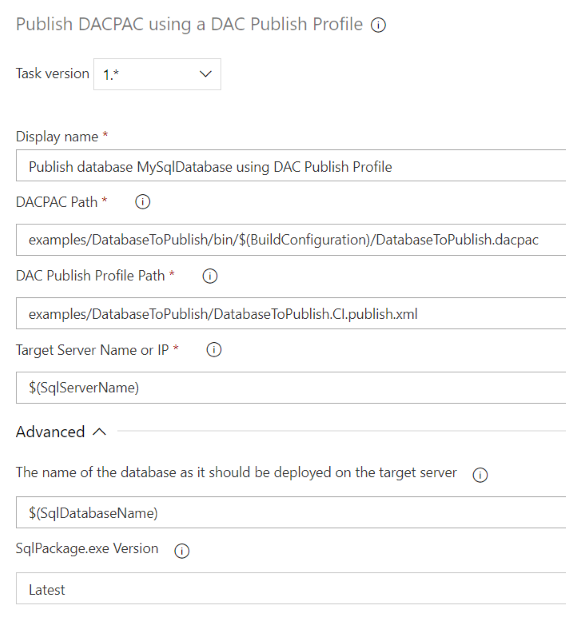

# Deployment tools for Azure Analysis Services and on-premise SSAS Tabular Cube Models

This extension adds four tasks to Azure DevOps which are ideal for integrating tabular cube models into your CI pipeline. With these tasks you can deploy, update, process and drop tabular cube models on an on-premise Microsoft SQL Server Analysis Services (SSAS) server.

| Task     | Description                                                             |
|---------------|--------------------------------------------------------------------------|
| Deploy SSAS tabular cube model | Publish a tabular cube model to an SSAS instance |
| Update SSAS tabular cube data source | Update SSAS tabular cube data source connection string to use an on-premise SQL Server database |
| Process SSAS Tabular cube model | Load a SSAS tabular cube model with data from an an on-premise SQL Server database by processing the cube |
| Drop SSAS tabular cube model | Delete tabular cube model from an SSAS instance (if it exists) |

As part of your CI pipeline you can use these tasks to deploy and populate your cube with data so you can run a suite of automated tests against your tabular model.

These tasks can also be used to automate the deployment of tabular cubes using [Release pipelines in Azure Pipelines](https://docs.microsoft.com/en-us/azure/devops/pipelines/release/what-is-release-management?view=azure-devops) in a continuously delivery scenario.  For those using [Octopus Deploy](https://octopus.com/) or [Chef](https://www.chef.io/), you can use the underlying PowerShell module [DeployCube](https://github.com/DrJohnT/DeployCube) to perform the same deployment tasks.

### Pre-requisites

The following pre-requisites need to be installed on your in-house build agent for the **Deploy SSAS Tabular Cube Model** task to work properly.

~~~~~~~~~~~~~~~~~~~~~~~~~~~~~~~~~~~~~~~~~~~~~~~~~~~~~~~~~~~~~~~~~~~~~ powershell
Microsoft.AnalysisServices.Deployment.exe
~~~~~~~~~~~~~~~~~~~~~~~~~~~~~~~~~~~~~~~~~~~~~~~~~~~~~~~~~~~~~~~~~~~~~~~~~~~~~~~~

Microsoft.AnalysisServices.Deployment.exe is known as the [Analysis Services Deployment Utility](https://docs.microsoft.com/en-us/sql/analysis-services/multidimensional-models/deploy-model-solutions-with-the-deployment-utility?view=sql-server-2017) and is installed alongside [SQL Server Management Studio](https://docs.microsoft.com/en-us/sql/ssms/download-sql-server-management-studio-ssms?view=sql-server-2017) (SSMS).

The module also requires the Microsoft SQL Server PowerShell module **SqlServer** which is installed automatically by the task.

### Admin privileges required by the Agent Service Account

In order to successfully deploy a tabular cube, the [Azure Pipelines self-hosted agent](https://docs.microsoft.com/en-us/azure/devops/pipelines/agents/agents?view=azure-devops) needs to run under a service account that has admin privileges on your target SQL Server Analysis Services instance.  When installed, the agent appears in the _Services Management Console_ (services.msc) as **VSTS Agent (YourDomain.AgentName)**.  Please ensure that this service runs under a AD domain service account with admin privileges on your target SQL Server Analysis Services instance.  As outlined on Microsoft's guide to [Azure Pipelines self-hosted agents](https://docs.microsoft.com/en-us/azure/devops/pipelines/agents/agents?view=azure-devops), the agent must have "line of sight" connectivity to the target servers.

## Example Pipeline

The screenshots below show how the components can be used in your CI pipeline.

First the pipeline builds the solution using VsBuild.  The solution contains a SQL Server database project and a SSAS tabular cube project, so the build produces a DACPAC for the SQL database and an _.asdatabase_ file for the tabular cube model.  Next, we deploy the SQL Database using our sister component [Publish DACPAC using a DAC Publish Profile](https://marketplace.visualstudio.com/items?itemName=DrJohnExtensions.PublishDacPac)

We ensure the build server has no remnants of the previous build by dropping the tabular model if it exists using the **Drop SSAS tabular cube model** task.  We use the **Deploy SSAS Tabular Cube Model** task to publish the tabular cube to the build server.
We then update the connection string inside the cube so that it points to the previously deployed SQL Server database using the **Update SSAS tabular cube data source** task.
Next, we process the cube so that it contains data using the **Process SSAS Tabular cube model** task.  The cube would now be ready for you to run a suite of automated tests.

## Deploy SSAS Tabular Cube Model

When you perform a **build** in a Visual Studio cube project, it creates an _.asdatabase_ file which defines the entire model including dimensions, attributes, measures, data sources and DAX calculations.  In the above pipeline VsBuild to create the _.asdatabase_ file from the Visual Studio solution.

The basic inputs for the **Deploy SSAS Tabular Cube Model** task are simply the path to the _.asdatabase_ file, the target SSAS server and target cube database name.  Note that the tabular cube is always deployed without processing, as the data source connection settings are likely to be incorrect.  The **Process SSAS Tabular cube model** task can be used to load data into the cube.

The task also offers the following deployment options for fine control over your deployment.

## Update SSAS tabular cube data source

The **Update SSAS tabular cube data source** task allows you to change the connection string to the underlying data source. The task reads the existing connection string and replaces the server name and database name to those supplied in the task.  Note that this task works on the deployed tabular cube, so must be done post-deployment.

## Process SSAS Tabular cube model

The **Process SSAS Tabular cube model** task allows you to process the newly deployed tabular cube model so that it contains data.  Once the cube contains data, you can run a suite of automated tests against your cube to check it contains the right values.

## Drop SSAS tabular cube model

The **Drop SSAS tabular cube model** task is usually used at the beginning of your build pipeline to ensure the target server has no remnants of previous builds.

## VsBuild Task

VsBuild is used to build the Visual Studio solution that contains a SQL Server database project and the SSAS tabular cube project.  This produces a DACPAC for the SQL database and an _.asdatabase_ file for the tabular cube model.

## Publish DACPAC using a DAC Publish Profile Task

We deploy the SQL Database using our sister component [Publish DACPAC using a DAC Publish Profile](https://marketplace.visualstudio.com/items?itemName=DrJohnExtensions.PublishDacPac) with the following settings:

