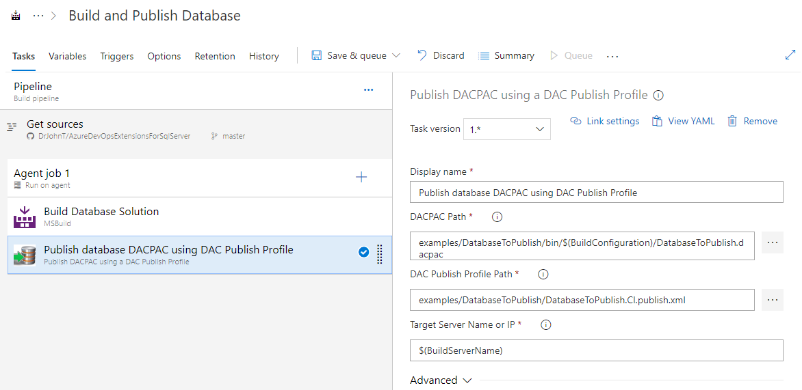
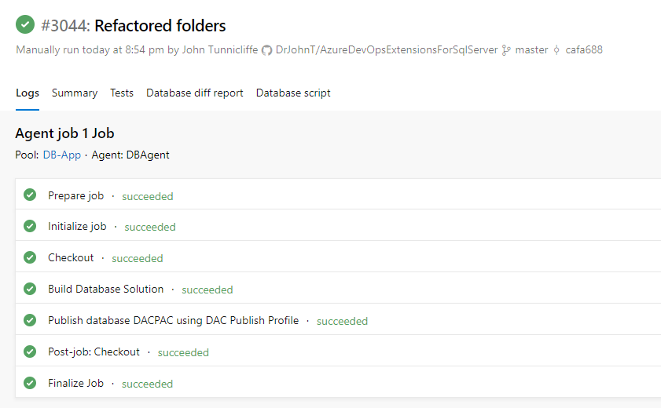
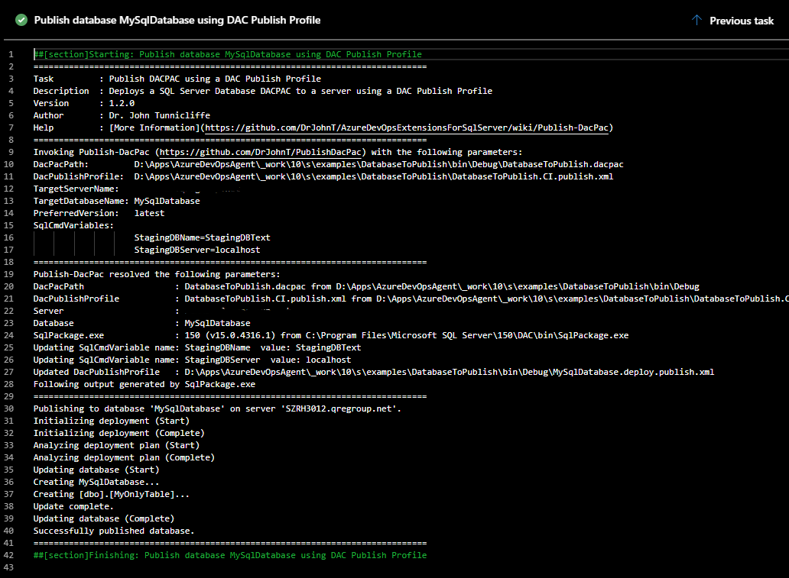

[](https://marketplace.visualstudio.com/items?itemName=DrJohnExtensions.PublishDacPac)
[](https://github.com/DrJohnT/AzureDevOpsExtensionsForSqlServer/blob/master/LICENSE)
[](https://dev.azure.com/drjohnt/AzureDevOpsExtensionsForSqlServer/_build/latest?definitionId=6)
[](https://www.powershellgallery.com/packages/PublishDacPac)

[](https://paypal.me/drjohnt)

# Publish DACPAC using a DAC Publish Profile

Designed for use on an [Azure Pipelines self-hosted agent](https://docs.microsoft.com/en-us/azure/devops/pipelines/agents/agents?view=azure-devops), the **Publish DACPAC** task allows you to deploy a SQL Server Database to a SQL Server instance using a DACPAC and a DAC Publish Profile.  The target can be a on-premise SQL Server instance, an Azure SQL Managed Instance or an Azure SQL Database.

# What's New

**Azure SQL Managed Instance** and **Azure SQL Database** deployment is now supported.  Such deployments require a username/password combination to connect to the Azure SQL service.  Simply select *SQL Server or Azure SQL Authentication* in the *Authentication Method* dropdown and enter your Azure username and password.  Remember to use a secured variable for your password!

**Encrypted Connections** for database deployment are now supported.

**Deployment Script** generation is now supported.  This means you can generate a SqlCmd deployment script to run against your target server instead of performing actual the deployment.  This script could be the artifact that gets approved for deployment.  The danger of this approach of course is that database model on your production server could 'drift' between generation of the deployment script and the actual deployment.  Performing an incremental deploy of a DacPac is a much safer idea, but this was a feature request.

**Deployment Report** are created if you provide a file path in the Deploy Report Path parameter.

# The power of SQL Server Data Tools (SSDT)

SQL Server Data Tools (SSDT) is Microsoft's design tool to declare the entire database model including tables, views, stored procedures, functions, schemas, etc. etc. covering **all** aspects of the database design.  When you perform a **build** of a SSDT Visual Studio project, it creates a [DACPAC](https://msdn.microsoft.com/en-IN/library/ee210546.aspx) which defines all of the SQL Server objects associated with a database.  Once you have a [DACPAC](https://msdn.microsoft.com/en-IN/library/ee210546.aspx), it can be deployed using the **Publish** function in Visual Studio, or by using the [SqlPackage.exe](https://docs.microsoft.com/en-us/sql/tools/sqlpackage) command-line interface.

The **Publish DACPAC** task simplifies the use of [SqlPackage.exe](https://docs.microsoft.com/en-us/sql/tools/sqlpackage) to deploy a database from a [DACPAC](https://msdn.microsoft.com/en-IN/library/ee210546.aspx) using a [DAC Publish Profile](https://github.com/DrJohnT/AzureDevOpsExtensionsForSqlServer/wiki/DAC-Publish-Profile).  The great thing about [DAC Publish Profiles](https://github.com/DrJohnT/AzureDevOpsExtensionsForSqlServer/wiki/DAC-Publish-Profile) is that they give you fine-grained control over how your database is upgraded.  Essentially, during a database upgrade, [SqlPackage.exe](https://docs.microsoft.com/en-us/sql/tools/sqlpackage) compares the content of the DACPAC with the existing database and generates a custom SQLCMD script which alters (upgrades) only those objects that are affected.  You can tailor how [SqlPackage.exe](https://docs.microsoft.com/en-us/sql/tools/sqlpackage) operates through the settings in the [DAC Publish Profile](https://github.com/DrJohnT/AzureDevOpsExtensionsForSqlServer/wiki/DAC-Publish-Profile). Typically, you will have several [DAC Publish Profile](https://github.com/DrJohnT/AzureDevOpsExtensionsForSqlServer/wiki/DAC-Publish-Profile) within your Visual Studio solution; one for the CI pipeline, one for deployment during development and another for production upgrades.  This is all explained in our guide to the [DAC Publish Profile here](https://github.com/DrJohnT/AzureDevOpsExtensionsForSqlServer/wiki/DAC-Publish-Profile).

To create a [DAC Publish Profile](https://github.com/DrJohnT/AzureDevOpsExtensionsForSqlServer/wiki/DAC-Publish-Profile) you simply **Publish** from within Visual Studio.  Clicking the **Save Profile** button in the **Publish** screen saves your [DAC Publish Profile](https://github.com/DrJohnT/AzureDevOpsExtensionsForSqlServer/wiki/DAC-Publish-Profile) into your Visual Studio project for later re-use.

## Pre-requisites

### Install SqlPackage.exe

The **Publish-DacPac** task can be run on an [Azure Pipelines self-hosted agent](https://docs.microsoft.com/en-us/azure/devops/pipelines/agents/agents?view=azure-devops) once [SqlPackage.exe](https://docs.microsoft.com/en-us/sql/tools/sqlpackage) is installed.  This can be done by installing one of the following:

* [Microsoft® SQL Server® Data-Tier Application Framework](https://docs.microsoft.com/en-us/sql/tools/sqlpackage-download)

* Visual Studio 2012 or later

Note that the latest [SQLPackage.exe](https://docs.microsoft.com/en-us/sql/tools/sqlpackage-download) provides support for all previous versions of SQL Server.

### SysAdmin privileges required by the Agent Service Account

In order to successfully deploy a database, the [Azure Pipelines self-hosted agent](https://docs.microsoft.com/en-us/azure/devops/pipelines/agents/agents?view=azure-devops) needs to run under a service account that has SysAdmin privileges on your target SQL Server instance.  When installed, the agent appears in the _Services Management Console_ (services.msc) as **VSTS Agent (YourDomain.AgentName)**.  Please ensure that this service runs under a AD domain service account with SysAdmin privileges on your target SQL Server instance.  As outlined on Microsoft's guide to [Azure Pipelines self-hosted agents](https://docs.microsoft.com/en-us/azure/devops/pipelines/agents/agents?view=azure-devops), the agent must have "line of sight" connectivity to the target servers.

## Continuous Deployment

The **Publish DACPAC** task can be used to automate the deployment of databases, either as part of a build in an Azure Pipeline, or as part of a server deployment using Azure DevOps Release Manager.  To deploy databases using [Octopus Deploy](https://octopus.com/) or other deployment service, you can utilise the PowerShell module [PublishDacPac](https://github.com/DrJohnT/PublishDacPac/) which underpins the this task which is available on the [PowerShell Gallery here](https://www.powershellgallery.com/packages/PublishDacPac/).

## Input Parameters

The following screenshot shows all the input parameters for the **Publish DACPAC** task which are explained in detail below.


### DACPAC Path
Relative path to the database DACPAC that needs to be deployed.  Wildcards can be used.  Note that the repo root is held in the variable $(System.DefaultWorkingDirectory).

### DAC Publish Profile Path
Relative path to the DAC Publish Profile.  Wildcards can be used.  Note that the repo root is held in the variable $(System.DefaultWorkingDirectory)

### Target Server Name or IP address
Name of the target server, including instance and port if required.  Setting this overwrites the server defined in the DAC Publish Profile

### Target Database Name
Optional. Normally, the database will be named the same as your DACPAC.  However, by completing this parameter, you can name the database anything you like.
Setting this overwrites the database name defined in the DAC Publish Profile.

### Overwrite SQLCMD Variables Options
Choose if you wish to overwrite SQLCMD Variables within the DAC Publish Profile.  If so, select the format in which you will provide the values.  We recommend JSON format as this is easy to validate in editors such as Visual Studio Code.

#### SqlCmd Variables and Values
Optional.  A multi-line string containing SqlCmd Variables to be updated within the DAC Publish Profile. Using the previous selector, you can choose to provide these in either JSON format or as name/value pairs as depicted below.

JSON format
```json
{
    "StagingDBName": "$(StagingDBName)",
    "StagingDBServer": "$(SqlServerName)"
}
```

Name/value pairs
```yaml
StagingDBName=$(StagingDBName)
StagingDBServer=$(SqlServerName)
```

### SqlPackage.exe Version
Defines the preferred version of SqlPackage.exe to use.  Simply pick 'latest' to use the latest version which can be used to deploy to all previous version of SQL Server.  Note that if the preferred version cannot be found, the latest version will be used instead.

|Version|SQL Server Release|
|-------|------------------|
|latest|Latest SQL Server version found on agent|
|150|SQL Server 2019|
|140|SQL Server 2017|
|130|SQL Server 2016|
|120|SQL Server 2014|

## Example Configuration

The following screenshot shows all the input parameters for the **Publish DACPAC** task which are explained in detail at the bottom of the page.


## Example Pipeline

To automate build and deployment of databases in Azure DevOps, you can use the MsBuild task to create DACPAC from your Visual Studio solution.  You can then add the **Publish DACPAC** task to deploy the DACPAC using your own custom [DAC Publish Profile](https://github.com/DrJohnT/AzureDevOpsExtensionsForSqlServer/wiki/DAC-Publish-Profile).

Below we show an example pipeline in Azure DevOps.  First MsBuild builds the project.  Second, the **Publish DACPAC** task deploys the database to your server.  Typically, as part of a build, this will be an SQL Server instance on the actual build server machine.


Configure the settings for the **Publish DACPAC** task by entering the location that the previous build step will place the DACPAC.



Save and queue your build. A few minutes later, you should see a screen like this in Azure DevOps.



Below is the output of the Publish DACPAC task for a very simple database.



